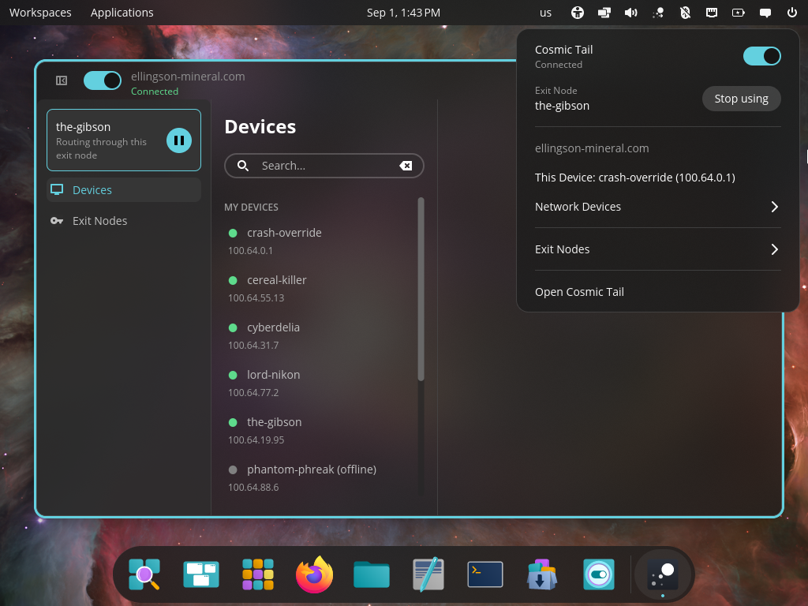
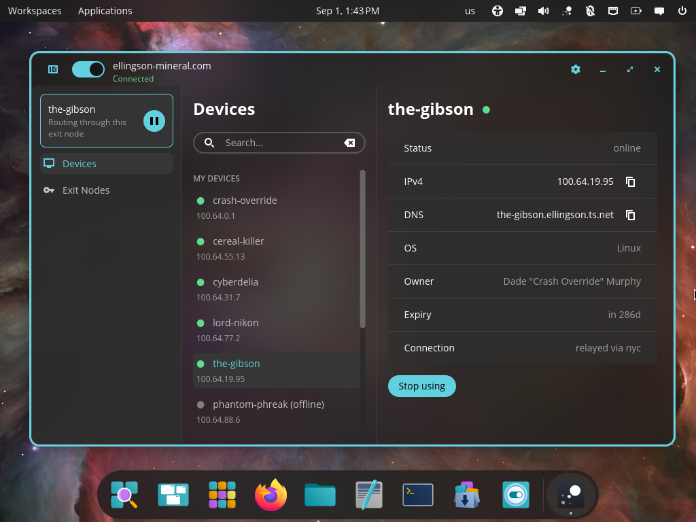
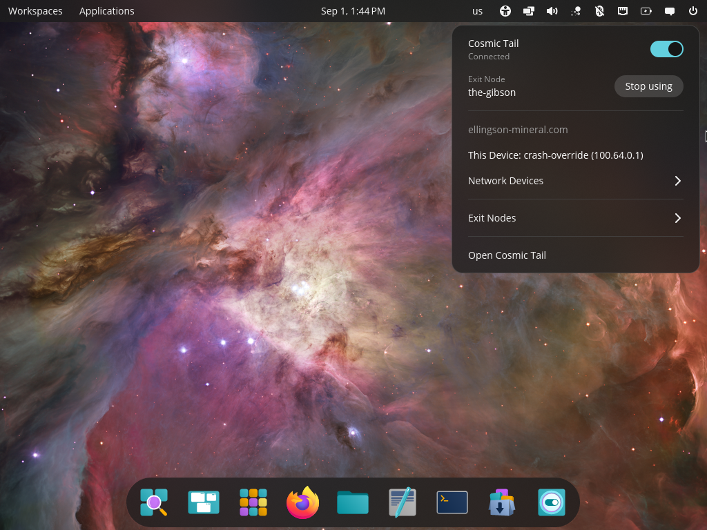

<p align="center">
  
  
  
</p>

# Cosmic Tail

A native [COSMIC desktop](https://system76.com/cosmic) app and applet for [Tailscale](https://tailscale.com).

Both the app and applet are written in Rust with [libcosmic](https://github.com/pop-os/libcosmic), so they follow the COSMIC
theme and behave like the rest of the desktop.

## Installation

### 1. Install Tailscale first

Cosmic Tail is a front end, not a Tailscale implementation. It talks to the
Tailscale daemon (`tailscaled`) over its local socket, so `tailscaled` has to be installed and
running on the machine before Cosmic Tail can do anything useful.

Follow the official instructions for your distribution:
<https://tailscale.com/docs/install/linux>

Then bring the machine onto your tailnet, and grant your user account
permission to change Tailscale settings:

```sh
sudo tailscale up
sudo tailscale set --operator=$USER
```

That last step matters. Without it the daemon answers status queries but
rejects every write, so Cosmic Tail can show your tailnet but cannot connect,
disconnect or change your exit node. Log out and back in after running it.

### 2. Build and install Cosmic Tail

Building needs a [Rust toolchain](https://rust-lang.org/tools/install/) and the [`just`](https://github.com/casey/just) command
runner, plus the usual libcosmic build dependencies (on Pop!\_OS and Ubuntu:
`libxkbcommon-dev`, `libwayland-dev` and `pkg-config`).

```sh
git clone https://github.com/frozenjava/CosmicTail.git
cd CosmicTail
just
sudo just install
```

- `just` builds the application with the default `just build-release` recipe
- `just run` builds and runs the window
- `just run-applet` runs the applet outside the panel, for testing
- `just install` installs both binaries, the desktop entries and the icons into
  the system (`rootdir` and `prefix` change where)
- `just uninstall` removes them again
- `just vendor` creates a vendored tarball
- `just build-vendored` compiles with vendored dependencies from that tarball
- `just check` runs clippy on the project to check for linter warnings
- `just check-json` can be used by IDEs that support LSP

For a development install that needs no root, `just dev-install` symlinks debug
builds into `~/.local` — which is already on the PATH the panel passes to the
applets it launches — and `just dev-uninstall` takes them back out.

### 3. Add the applet to your panel

The window shows up in the app grid as **Cosmic Tail**. The applet is added
separately, under **Settings → Desktop → Panel → Configure applets**; the app's
own settings page has a button for it too. Click its panel icon to open the
popup.

## Troubleshooting

| What you see | What it means |
| --- | --- |
| "tailscaled is not running, or its socket is unreachable" | The daemon is not up. `sudo systemctl status tailscaled` |
| Everything is read-only; connecting fails | Your user is not the Tailscale operator. Run `sudo tailscale set --operator=$USER`, then log out and back in |
| The applet is missing from the panel list | The binary is not on the panel's PATH. `just dev-install` or `just install` first, then check the applet list again |

The applet's stderr goes to the journal, prefixed with its app id, so
`journalctl --user -f` shows it live. Set `RUST_LOG=cosmic_tail=debug` for more
than warnings.


> Cosmic Tail is a third-party application. It is not affiliated with, endorsed by, or supported by Tailscale Inc or System76.
